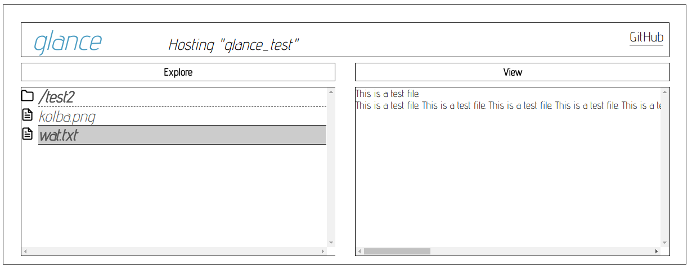

<p align="center">

</p>

<p align="center"><i>A remote file browsing application built with the <a href="https://github.com/kernelsauce/turbo">Turbo</a> framework.</i></p>

---

**Better documentation coming soon.**

# What is glance?

Glance is an open source tool for easily sharing the contents of a folder with people through the web.



# Run it

## Ubuntu 18.04
Edit "src/config.lua" before proceeding.
```
$ apt-get install luajit luarocks git build-essential libssl-dev
$ luarocks make
$ turbovisor glance.lua
```
